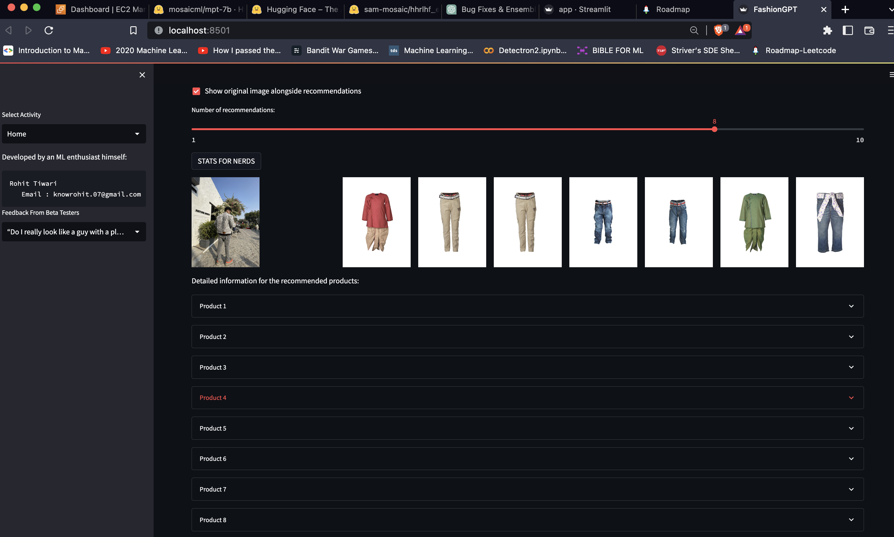

# FashionGPT: AI-Powered Fashion Recommender System & VirgilAblohGPT: Hypebeast Chatbot Assistant 🥷🏻

This project combines two powerful components: FashionGPT, an AI-powered fashion recommender system, and VirgilAblohGPT, a fashion chatbot assistant powered by ChatGLM-6b. Together, they provide a comprehensive fashion experience, acting as your guide and hype beast friend.

 

## How it Work

FashionGPT uses a pre-trained ResNet50 model as a feature extractor to analyze the visual aspects of a user's selected image. It then compares the extracted features with a database of product images to find the most visually similar items. The Nearest Neighbors algorithm is employed to identify the top matching products based on their similarity scores. Users can choose to display the original image alongside the recommendations for easy comparison and can adjust the number of recommendations displayed. Additional product information and color palettes are also available for each recommendation.

## Main Screen
 

# Key Features

## FashionGPT
- State-of-the-art deep learning model for feature extraction
- Efficient and accurate product recommendations
- User-friendly interface for seamless interaction
- Option to display the original image alongside recommendations
- Adjustable number of recommendations
- Detailed information and color palettes for recommended products
- Wide range of supported fashion products
- Continually updated and refined to deliver the best results

## Product Recommendations

## Stats for Nerds

